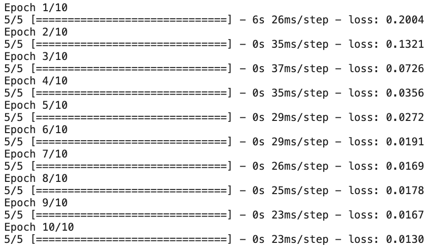
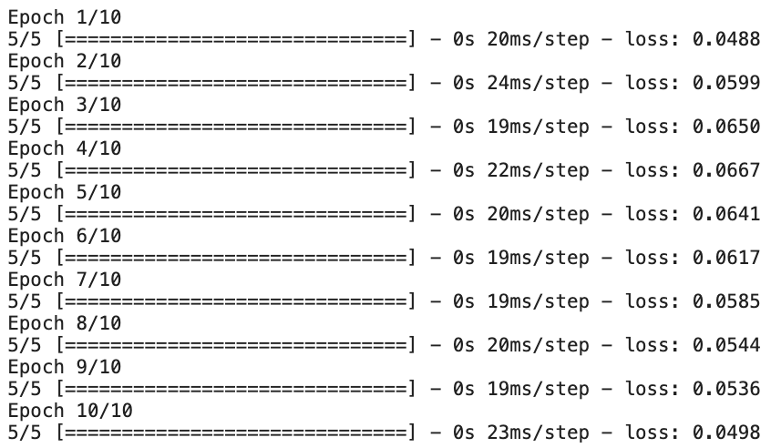
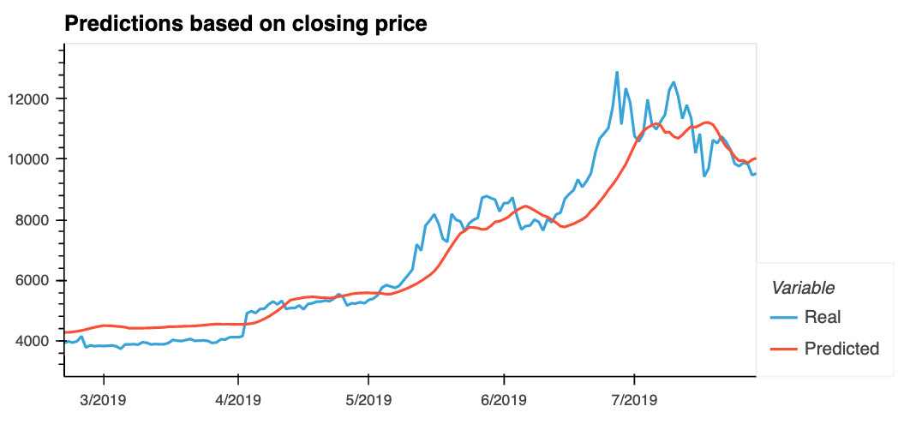
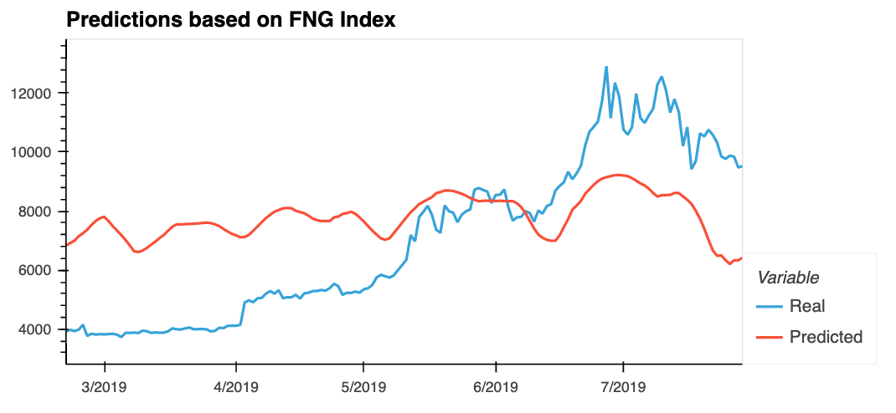

# HW11_Deep_Learning_Price_Prediction

### Determine which model had the lowest loss. 
The close model had a lower loss of 0.013.

The fng model had a higher loss of 0.049.

### Determine which model tracks the actual values best over time. 
In the plots below you can see that the model based on closing price did a much better job at trcking the actual price.

### Determine the appropriate Window Size for the model.

A window of 10 gave the best results.  It had a lower loss, and the plots appear more accurate. 
